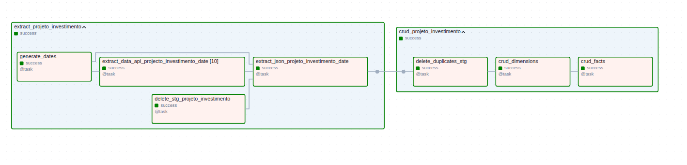

# Brazilian Goverment Data Extraction

This project was devoloped to extract data from a investiment API available by the Brazilian goverment, to provide valuble information about the projects being funded by the national goverment.

The tecnologies used on this project were: Python, Pyspark, Apache Airflow.

## Pipeline
The pipeline for this project consist on a extraction from a investiment project api (previously it had a extraction for a finantial execution api as well, but, because of problems with the api itself, i decided to remove it from the project, but you still can find the tasks and functions related to this part for history porposes). After the extraction, the data was stored on json files that were extracted and trasformed to a relational format to store in a postgres database. \
For last, the data was converted in a dimensional format, with the creation of dimensions and facts based on the data extracted.

You can see the entire pipeline on the picture bellow.

